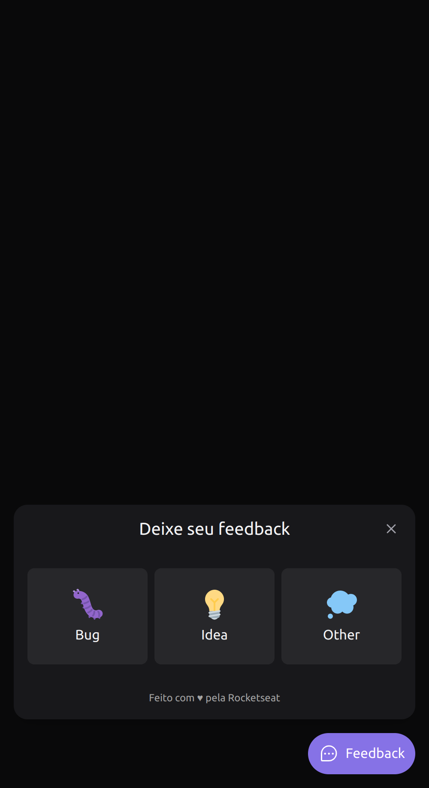
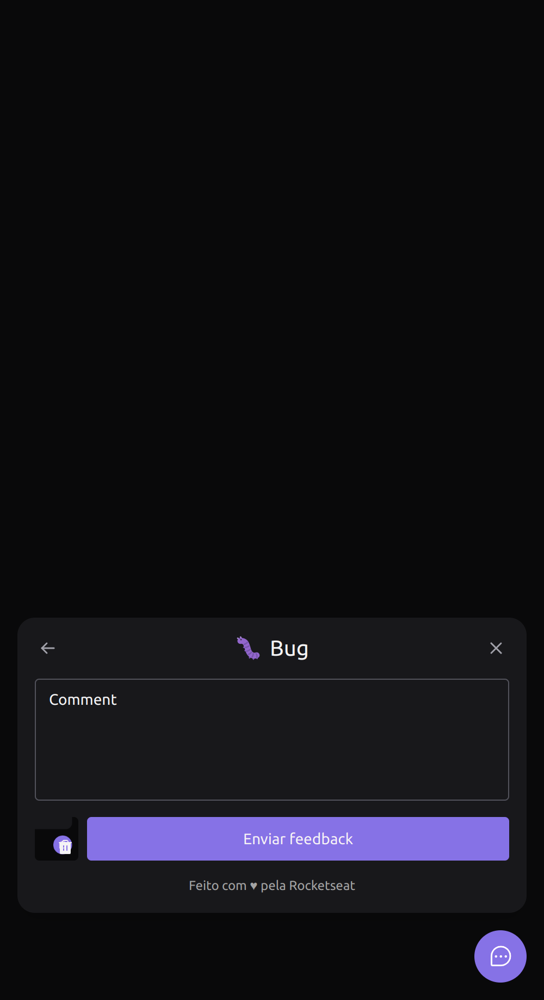
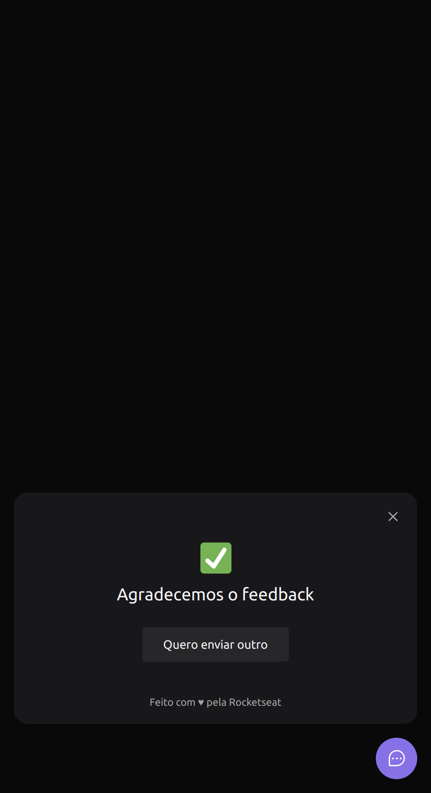

#NLW Return Impulse
#### _Web Application_

This is a project developed during the NLW Return Impulse of [Rocketseat](rocketseat.com.br).
Basically it's a widget to report user feedback through a dynamic form that selects Type, Comment and Screenshot and submits it to the backend.

Requirements
- Node.js
- NPM
- React
- *Vite
- ✨You can also use Docker to setup the environment✨


## Installation

```sh
-git clone https://github.com/adelino-masioli/nlw-impulse-web
-cd nlw-impulse-web
-npm i
-create a .env.local and set: VITE_API_URL=http://localhost:3333
-npm run dev
```

### Screenshot






### Developer
Adelino Masioli adelinomasioli@gmail.com Copyright (c) 2022